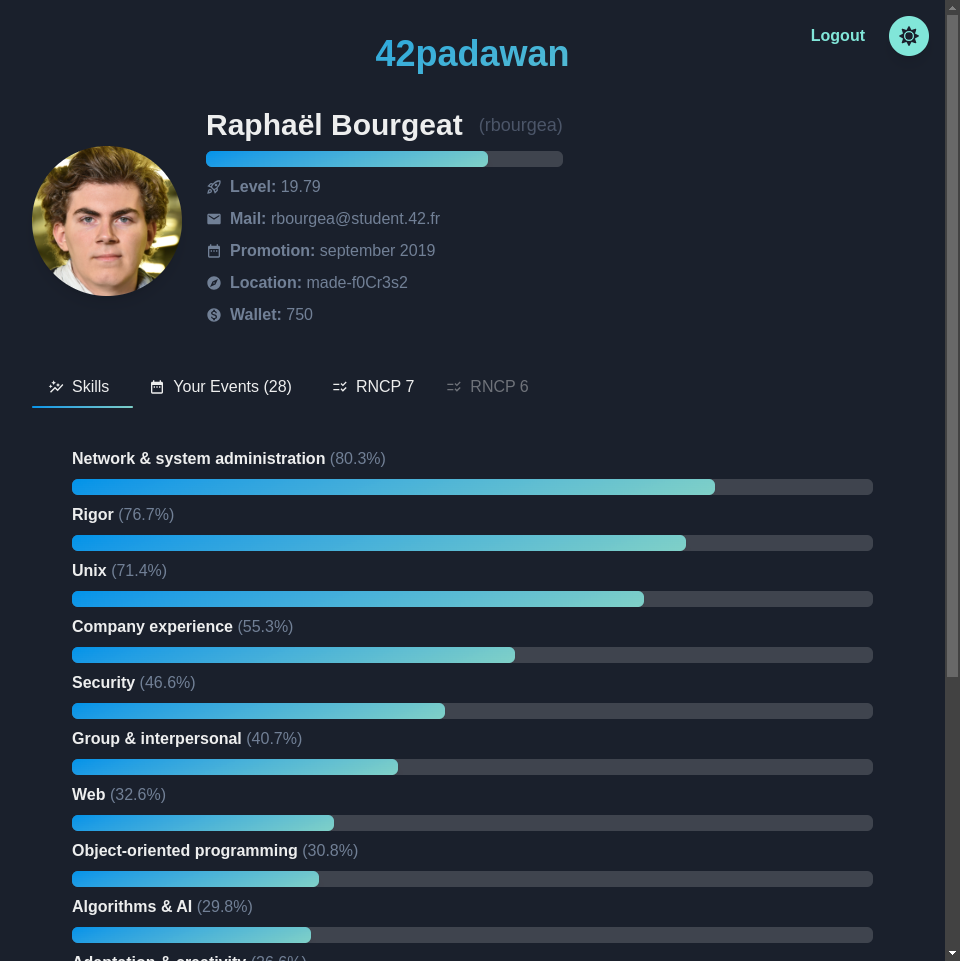
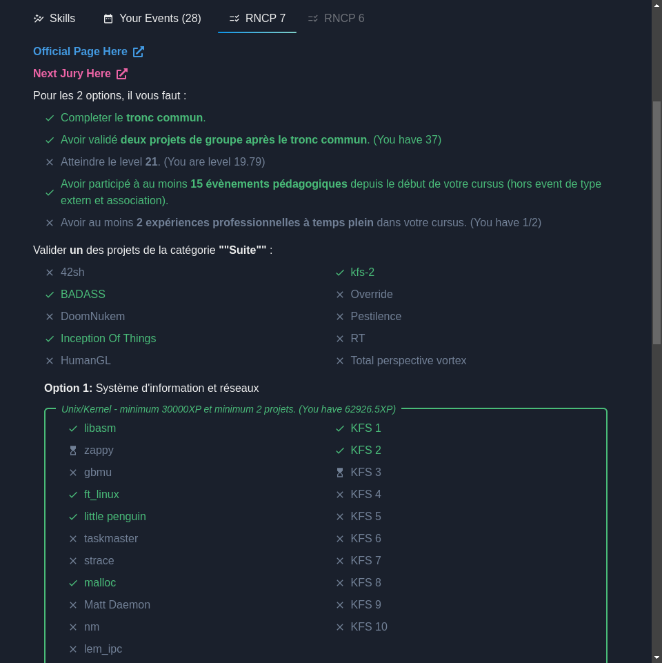
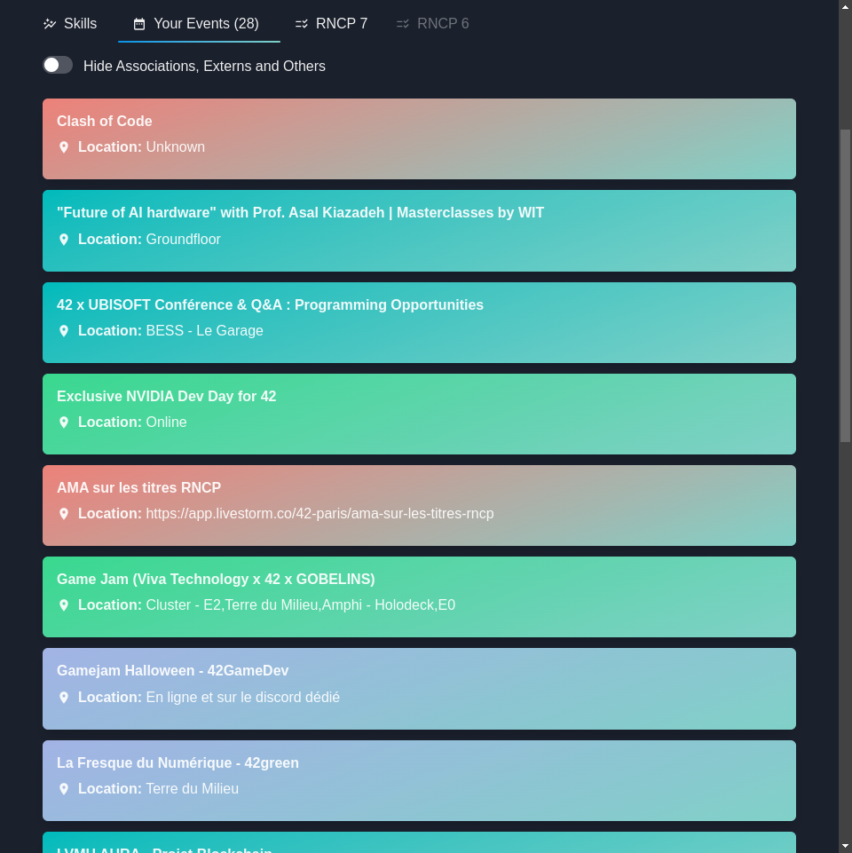

# 42padawan
My own 42 API front build with FastAPI/Python & React/Vite/Chakra

## Demo







## Requirements

- Install Docker

- Create your App on [42 intra](https://profile.intra.42.fr/oauth/applications/new), use `http://localhost:8000/auth/callback` as **Redirect URI**, copy `.env.example` in to `.env` fill the `.env`

## Usage

Up the project

```bash
make
```

Open <http://localhost:3000>

Stop it

```
make down
```
